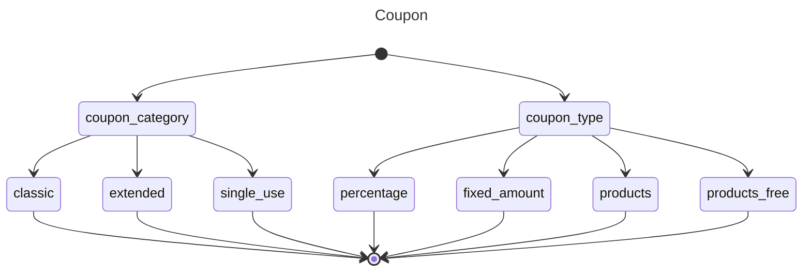
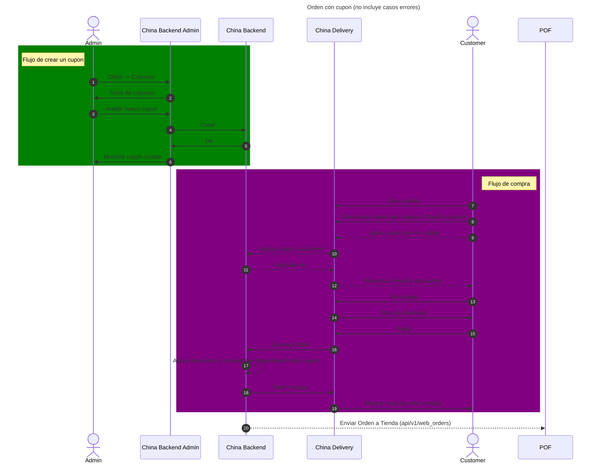
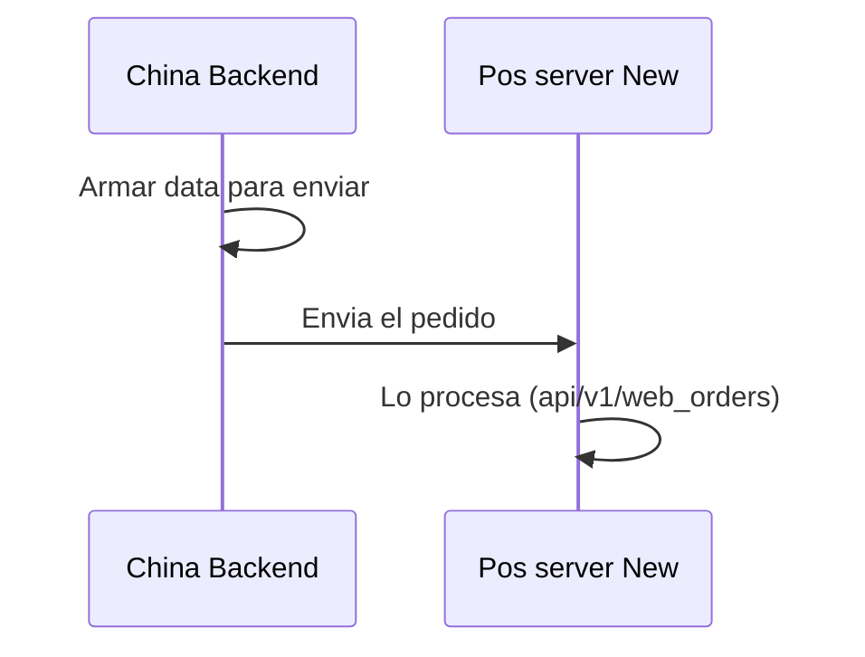
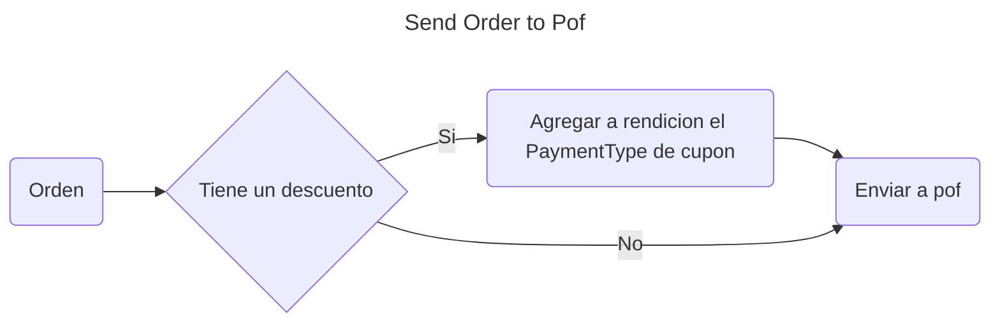

# Maquinas de estado

## Significado de cada estado

## Orden
#TODO

## Cupón (variante)

^06234c

# Secuencia (Creación orden)

## China delivery (web #TODO (ajuntar link a projecto))

^a750b5

# Conexiones con otros servicios o apps

## pof_server_new (adjuntar link a introduccion)

^05331e

### procesado

^530135

# Flujo
