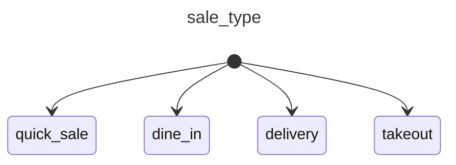
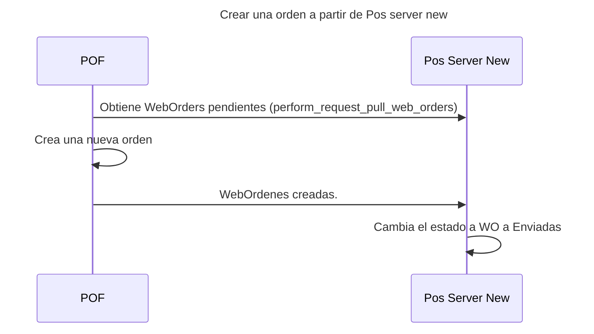

# Maquinas de estado

## Tipo de venta

## Significado de cada estado

# Secuencia

## pof_server_new (adjuntar link a introduccion)

### Crear nueva order a partir de pedidos web

^17d08c

# Conexiones con otros servicios o apps

# Flujo 