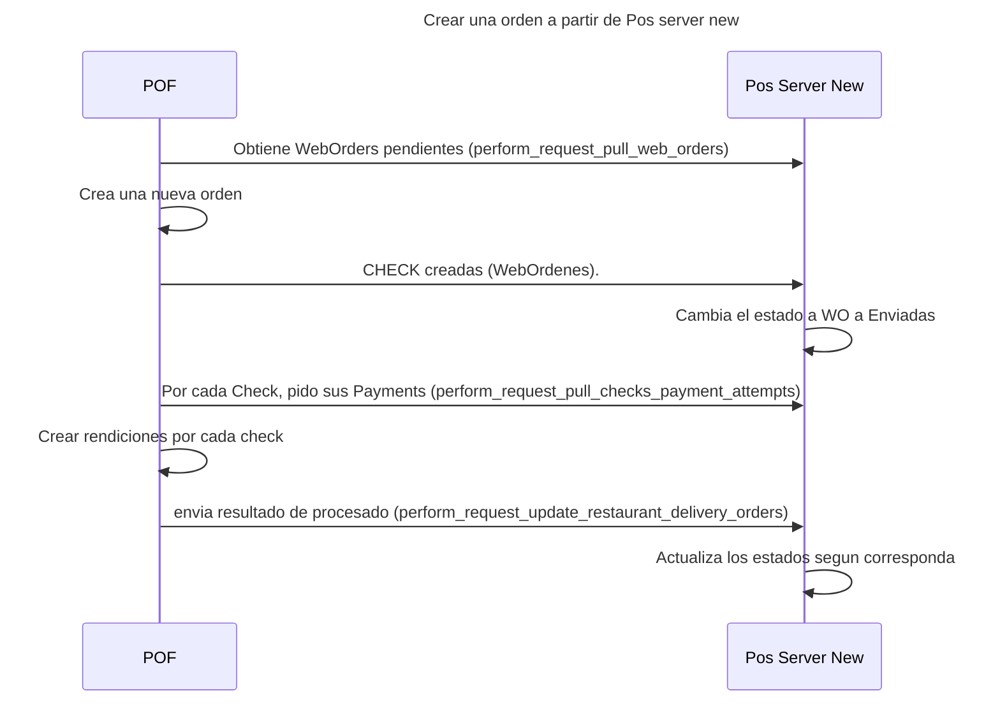

# Maquinas de estado

## Tipo de venta

## Significado de cada estado

# Secuencia

# Conexiones con otros servicios o apps

### Crear nueva order a partir de pedidos web

^17d08c

### Crear nueva order a partir de la tienda

# Flujo 