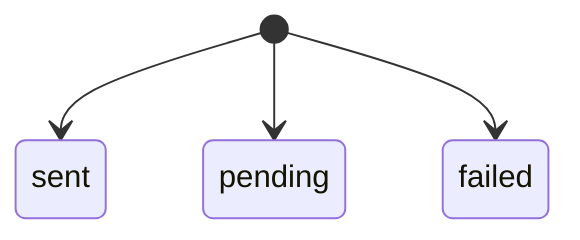
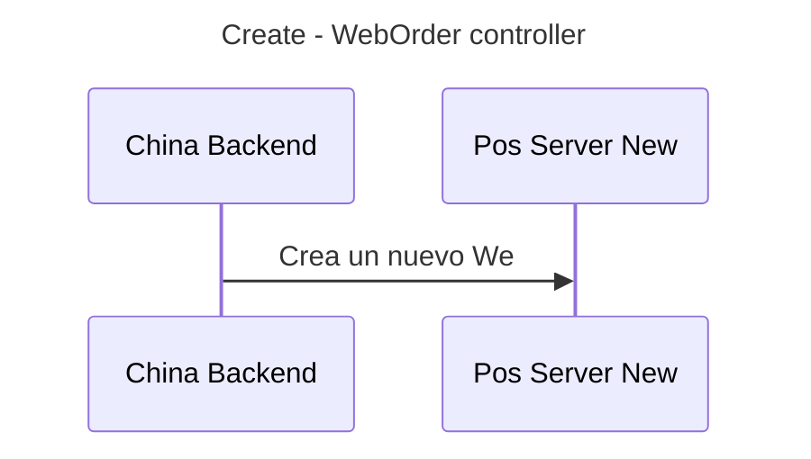
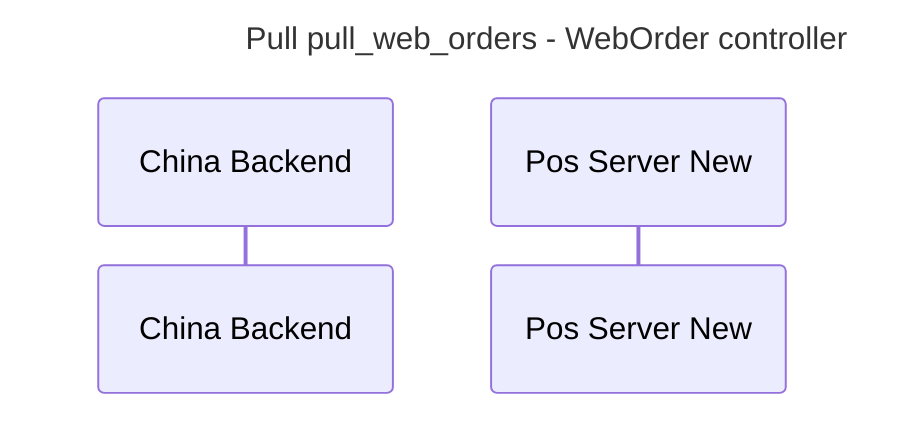

# Maquinas de estado

## Significado de cada estado

# Secuencia

# Creación WebOrder ~ Orden  de china backend

##  Oneclic

## Otro metio de pago

# Conexiones con otros servicios o apps

## China Backend
![[100_niufoods/03_projects/china_backend/documentation/orders/diagramns#^05331e|diagramns]]

# Flujo 