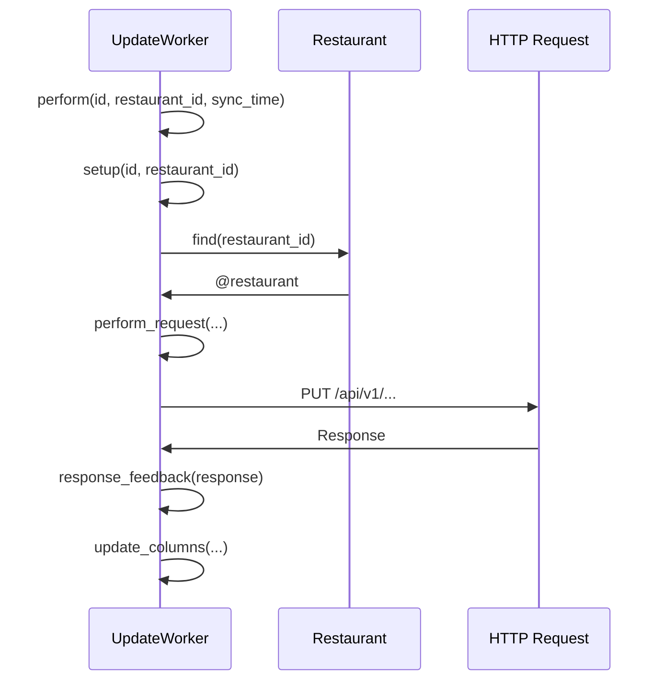

La fuente de la verdad la tiene la app de pos_server_new


```ad-note
collapse: closed
title: Sync desde el worker

dentro de una lib llamada
`lib/tasks/franchise.rake`
![[Pasted image 20230726151717.png]]

Esta librería se encarga de sincronizar todos los elementos dentro del array.

Para este caso, veremos cómo funciona el Tender

`Tender.sync_later!(1)`
```


```ad-note
collapse: open
title: Sync desde la pagina de admin en la seccion de restaurantes

1. Presiona botón sincronizar
2. Ejecuta controller de sync `app/controllers/admin/restaurants_controller.rb`
```

metodo del controller  `def sync_to_restaurants`
![[Pasted image 20230727104709.png]]

En donde
Restaurant.models_to_sync: es un arrray de modelos a sincronizar
Restaurant.sync_tp_restaurant:  `sync_to_restaurants` método heredado de `app/models/application_record.rb`
 ![[Pasted image 20230727104256.png]]

se separa en dos partes este metodo, a modo ilustrativo se utilizará `Tender` model

`Tender.first.restaurant_entities` (retorna una colección)
![[Pasted image 20230727105135.png]]

Lo impotante de aquí es el attributo de `needs_sync`, dado que solo hará match con los que son true


``


Los modelos a sincronizados herendan de `app/models/application_record.rb`
dado que necesitan el siguiente metodo método 

```ruby
  def sync_later!(restaurant_id, delay = 0.seconds)
    if shared_syncable_entities.include?(self.class) || global_syncable_entities.include?(self.class)
      worker = "RestaurantUpdate::#{self.class.name}Worker".safe_constantize
      return 'Non-syncable object' unless worker.present?

      worker.process(delay: delay, id: id, restaurant_id: restaurant_id, sync_time: Time.now.to_i)
    else
      'Non-syncable object'
    end
  end
```

```ruby
worker = "RestaurantUpdate::TenderWorker"
worker.process # Ejecución
```

Esto ejecuta este modulo.
![[Pasted image 20230726153005.png]]


