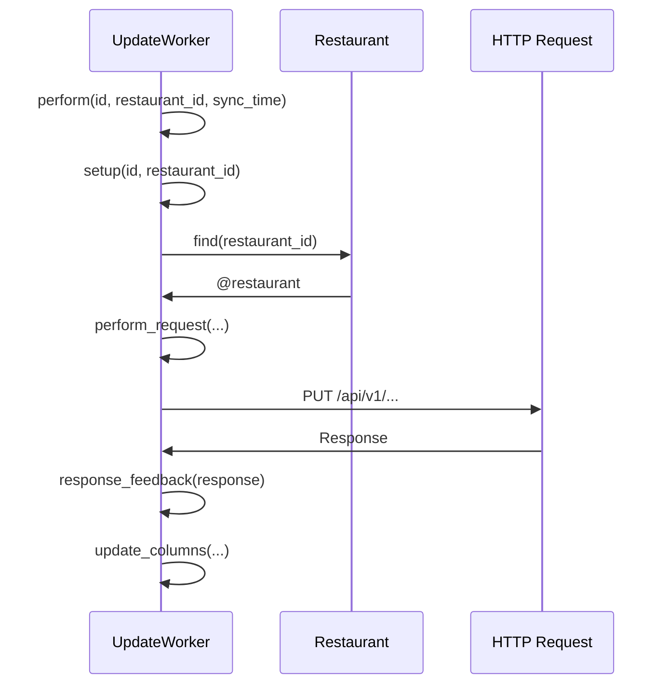

La fuente de la verdad la tiene la app de pos_server_new

<details>
  <summary><em>sync desde worker (solo restaurant con id 1 por o que no es) ✨</em></summary>
	dentro de una lib llamada
	`lib/tasks/franchise.rake`
	![[Pasted image 20230726151717.png]]
	
	Esta librería se encarga de sincronizar todos los elementos dentro del array.
	
	Para este caso, veremos cómo funciona el Tender
	
	`Tender.sync_later!(1)`
</details>

```ad-note
collapse: closed
title: Sync desde la pagina de admin en la seccion de restaurantes
color: 
```

Los modelos sincronizados herendan de `app/models/application_record.rb`
dado que necesitan un método 

```ruby
  def sync_later!(restaurant_id, delay = 0.seconds)
    if shared_syncable_entities.include?(self.class) || global_syncable_entities.include?(self.class)
      worker = "RestaurantUpdate::#{self.class.name}Worker".safe_constantize
      return 'Non-syncable object' unless worker.present?

      worker.process(delay: delay, id: id, restaurant_id: restaurant_id, sync_time: Time.now.to_i)
    else
      'Non-syncable object'
    end
  end
```

```ruby
worker = "RestaurantUpdate::TenderWorker"
worker.process # Ejecución
```

Esto ejecuta este modulo.
![[Pasted image 20230726153005.png]]


