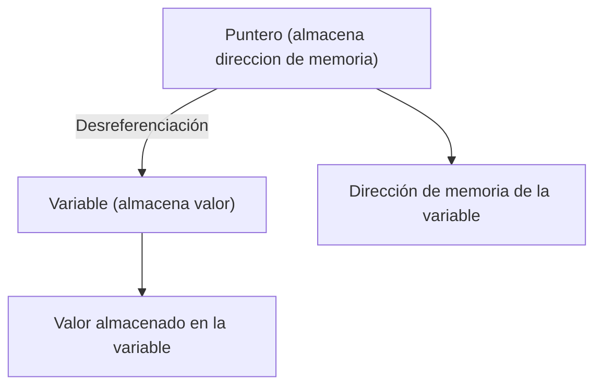

# Que es?
variable que almacena la dirección de memoria de otra variable
no el valor.

y son fundamentales para trabajar con estructuras de datos y para realizar operaciones de memoria eficientes.

##  Algunas características
**Aritmética de Punteros**: Puedes realizar operaciones aritméticas en punteros, como incrementar o decrementar la dirección de memoria que almacenan. Esto es útil para recorrer arreglos y acceder a sus elementos, por ejemplo.


**Desreferenciación**: Acceder al valor almacenado en la dirección de memoria a la que apunta un puntero se llama desreferenciación. Esto se hace utilizando el operador `*` en C y C++.

## Code
```c
#include <stdio.h>

  

int main() {

    int variable = 5;         // Una variable entera
    int *puntero;             // Un puntero a un entero
  

    puntero = &variable;      // Almacena la dirección de 'variable' en 'puntero'

  
    printf("Dirección de memoria de variable: %p\n", (void *) &variable);
    printf("Dirección almacenada en puntero: %p\n", (void *) puntero);
    printf("Valor al que apunta puntero: %d\n", *puntero);  // Desreferenciación
     return 0;
}
```
## Code 2
```c
#include <stdio.h>

  

int main() {

    int numero = 42; // Declaramos una variable entera y le asignamos el valor 42
    int *puntero;             // Un puntero a un entero
  

    puntero = &variable;      // Almacena la dirección de 'variable' en 'puntero'

  
    printf("Dirección de memoria de variable: %p\n", (void *) &variable);
    printf("Dirección almacenada en puntero: %p\n", (void *) puntero);
    printf("Valor al que apunta puntero: %d\n", *puntero);  // Desreferenciación
     return 0;
}
```

## Diagrama


